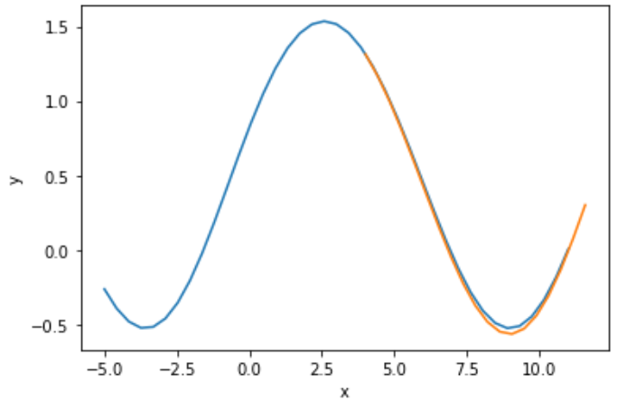
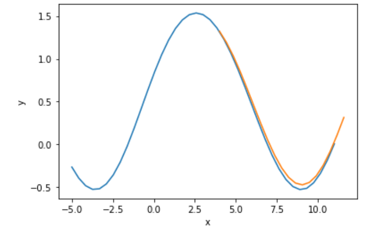

# Лабораторная работа №2(3)

## Графики предсказанных функций:
### Окно = 4 Норма обучения = 0.3

### Окно = 6 Норма обучения = 0.3

### Окно = 6 Норма обучения = 0.6


```
Copyright 2021, Evula A. S., All rights reserved.
```